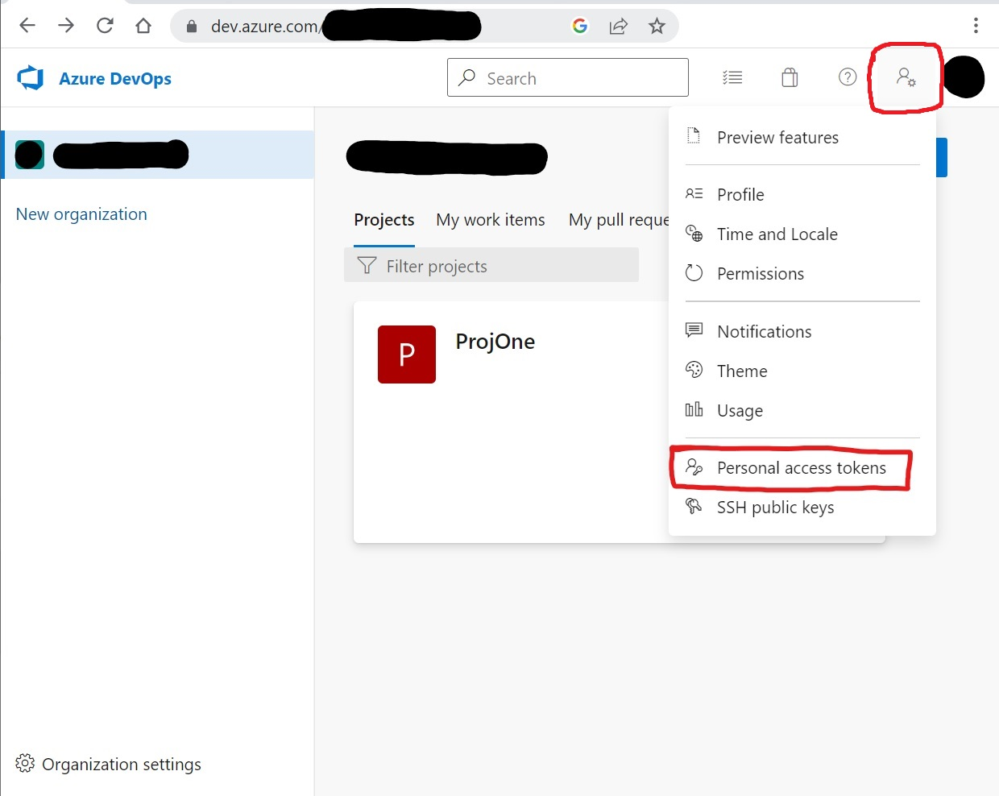
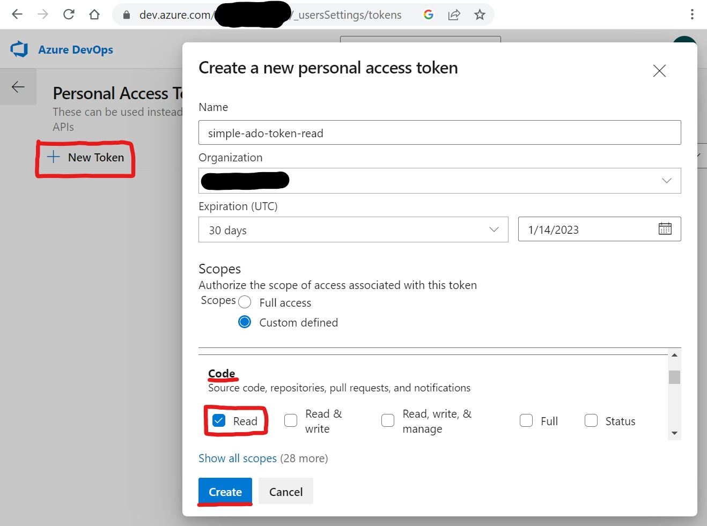
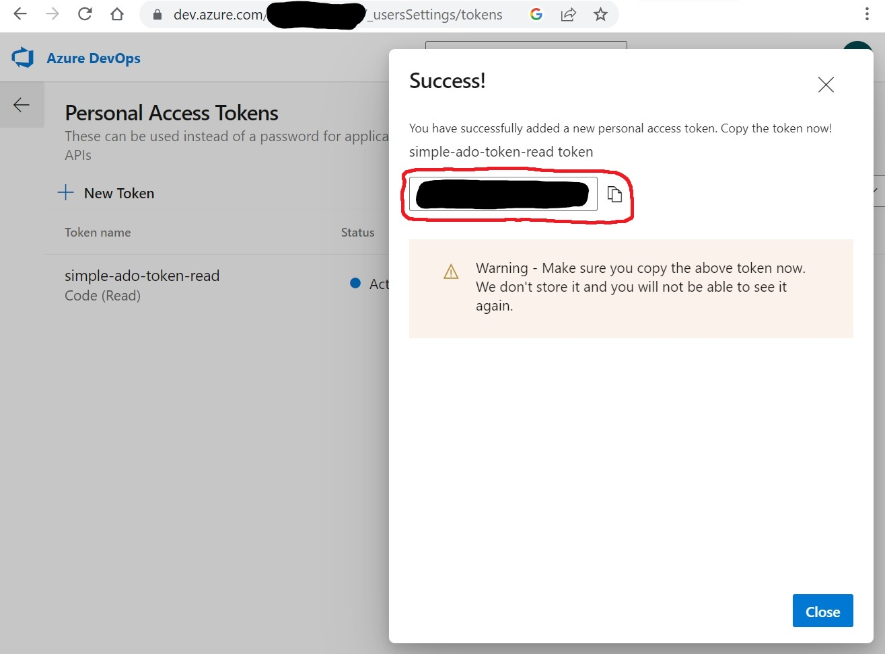

# Connect to ADO

You will need a personal access token (PAT) in order to connect to Azure DevOps.

## Go to the PAT page

First, navigate to the PAT page by going to the following url, or follow the navigate shown in the screenshot:

https://dev.azure.com/{your_org_here}/_usersSettings/tokens

## Create a PAT

From the PAT page, click "New Token" to open the new token modal.

Enter a name for your token and set an expiry. Then give the token "Code" -> "Read" permissions in order to allow the simple-ado app to view PR's. Click "Create" to create the token.

## Copy the PAT

Make sure to copy the PAT before closing the confirmation page. Once the page is closed you will no longer be able to retrieve the PAT and will need to create another.

